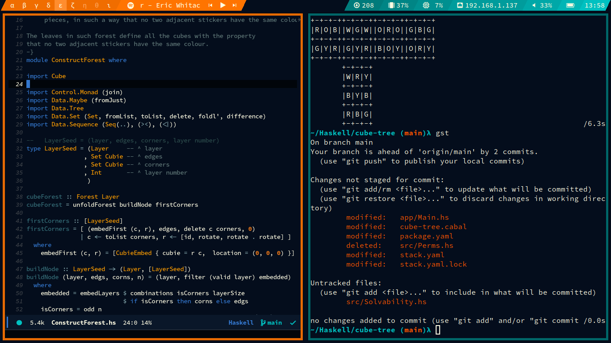
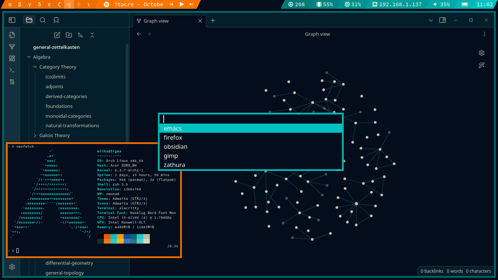
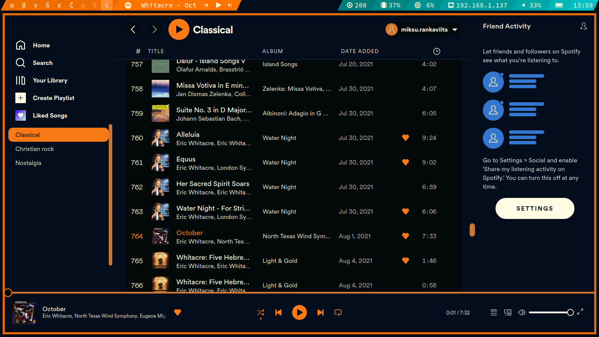

---

# Comfy Linux setup
 *This is the setup I use on my laptop. The color scheme is inspired by a sunset. Enjoy!*  

## Components
**OS:**&ensp;I use [Arch](https://archlinux.org), btw...

**WM:**&ensp;[XMonad](https://xmonad.org)/[`xmonad`](https://archlinux.org/packages/extra/x86_64/xmonad)

**Font:**&ensp;[Hasklig](https://github.com/i-tu/Hasklig) + [Nerd](https://www.nerdfonts.com/) = [`otf-hasklig-nerd`](https://archlinux.org/packages/extra/any/otf-hasklig-nerd/)

**Bar:**&ensp;[Polybar](https://github.com/polybar/polybar)/[`polybar`](https://archlinux.org/packages/extra/x86_64/polybar)

**App launcher:**&ensp;[dmenu](https://tools.suckless.org/dmenu)

**Lock screen:**&ensp;[slock](https://tools.suckless.org/slock)

**Terminal:**&ensp;[Alacritty](https://github.com/alacritty/alacritty)/[`alacritty`](https://archlinux.org/packages/extra/x86_64/alacritty)

**Shell:**&ensp;[ZSH](https://www.zsh.org)/[`zsh`](https://archlinux.org/packages/extra/x86_64/zsh/) + [Oh My ZSH](https://ohmyz.sh)

**Browser:**&ensp;[`firefox`](https://archlinux.org/packages/extra/x86_64/firefox/)

**Text editor:**&ensp;[Doom Emacs](https://doomemacs.org)/[`emacs`](https://archlinux.org/packages/extra/x86_64/emacs)

**Compositor:**&ensp;[Picom](https://github.com/yshui/picom)/[`picom`](https://archlinux.org/packages/extra/x86_64/picom/)

**Note-taking:**&ensp;[Obsidian](https://obsidian.md)/[`obsidian`](https://archlinux.org/packages/extra/x86_64/obsidian/)

**Spotify client:**&ensp;[`spotify`](https://aur.archlinux.org/packages/spotify) + [`spicetify-cli`](https://aur.archlinux.org/packages/spicetify-cli)

## More info and credits

  
Polybar

  
  The bar is based on a theme called *shapes* by [adi1090x](https://github.com/adi1090x/polybar-themes).
  
  In addition to the standard modules, the bar uses [`updates-pacman-aurhelper`](https://github.com/polybar/polybar-scripts/tree/master/polybar-scripts/updates-pacman-aurhelper)
  and [`spot-on`](https://github.com/MiksuR/spot-on).
  

  
Firefox

  I add styling to my Firefox instance with userChrome.css.
  It should be placed in the "Profile Directory" specified
  in about:support.

  
dmenu

  
  I use the following patches on dmenu:
  - [border](https://tools.suckless.org/dmenu/patches/border)
  - [center](https://tools.suckless.org/dmenu/patches/center)
  - [xresources](https://tools.suckless.org/dmenu/patches/xresources)
  
  In addition, I use the `run_recent` [script](https://tools.suckless.org/dmenu/scripts).
  

  
suspend@.service

  
  I have included a systemctl service that suspends the laptop when the lid is closed.
  
  The service file should be placed in `/etc/systemd/system/`.
  
  The service is activated by executing `systemctl enable suspend@<username>.service`.

