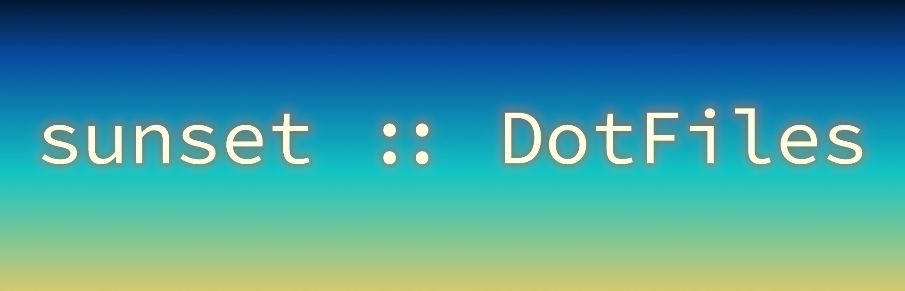

---


# Comfy Linux setup
<br />*This is the setup I use on my laptop. The color scheme is inspired by a sunset. Enjoy!*<br /><br />

## Components
**Distro:**&ensp;[NixOS](https://nixos.org)

**WM:**&ensp;[XMonad](https://xmonad.org)

**Font:**&ensp;[Hasklig](https://github.com/i-tu/Hasklig) + [Nerd](https://www.nerdfonts.com/)

**Bar:**&ensp;[Polybar](https://github.com/polybar/polybar)

**App launcher:**&ensp;[dmenu](https://tools.suckless.org/dmenu)

**Lock screen:**&ensp;[slock](https://tools.suckless.org/slock)

**Terminal:**&ensp;[Alacritty](https://github.com/alacritty/alacritty)

**Shell:**&ensp;[ZSH](https://www.zsh.org) + [Oh My ZSH](https://ohmyz.sh)

**Browser:**&ensp;[Firefox](https://www.mozilla.org/en-US/firefox)

**Text editor:**&ensp;[Doom Emacs](https://doomemacs.org)

**Compositor:**&ensp;[Picom](https://github.com/yshui/picom)

**Note-taking:**&ensp;[Obsidian](https://obsidian.md)

**Photo-editing/graphics design:**&ensp;[Affinity suite](https://affinity.serif.com/en-gb/) + [Darktable](https://www.darktable.org/) + [Inkscape](https://inkscape.org/) + [GIMP](https://www.gimp.org/)

**Video-editing:**&ensp;[Olive](https://github.com/olive-editor/olive) + [NATRON](https://natrongithub.github.io/)

## Implementation
My devices are configured declaratively in the _Nix programming language_. The rationale behind using NixOS is the ability to
deploy my personal configuration on a new machine with minimal user interaction and to rollback to previous versions in case
of breaking updates. For a good overview of the advantages to using NixOS, see [this video](https://www.youtube.com/watch?v=CwfKlX3rA6E).
Before migrating to using Nix I was using [Arch Linux](https://archlinux.org) btw, and my previous configuration can be found in the [`arch-linux`](https://github.com/MiksuR/dotfiles/tree/arch-linux) branch.

This set of dotfiles defines a **multi-host** configuration with the following structure (inspired by [EmergentMind's config](https://github.com/EmergentMind/nix-config)):
- `flake.nix` : entry-point
- `hosts/common` : loaded on all machines
- `hosts/[hostname]` : loaded only on the corresponding machine
- `home/[user]` : user specific configurations ([home-manager](https://github.com/nix-community/home-manager))

To install, clone this repo and run the following command.
```
nix run --experimental-features "nix-command flakes" nix-os -- switch --flake .#[hostname]
```

## More info and credits
<details>
  <summary>Polybar</summary>
  
  The bar is based on a theme called *shapes* by [adi1090x](https://github.com/adi1090x/polybar-themes).
  
  In addition to the standard modules, the bar uses [`spot-on`](https://github.com/MiksuR/spot-on).
  
</details>

<details>
  <summary>dmenu</summary>
  
  I use the following patches on dmenu:
  - [border](https://tools.suckless.org/dmenu/patches/border)
  - [center](https://tools.suckless.org/dmenu/patches/center)
  
  In addition, I use the `run_recent` [script](https://tools.suckless.org/dmenu/scripts).
  
</details>

<details>
  <summary>Affinity suite</summary>

  To get the Affinity programs running on Linux, one needs to build [ElementalWarrior's Wine fork](https://gitlab.winehq.org/ElementalWarrior/wine/-/tree/affinity-photo3-wine9.13-part3?ref_type=heads).
  The current configuration builds the fork automatically. To finish the installation, one needs to set up a Wine
  prefix as in [this guide](https://affinity.liz.pet/docs/3-wineprefix_setup.html#setting-up-your-build-and-wineprefix):

  ```
  $ wineboot --init
  $ winetricks --unattended dotnet48 corefonts
  $ winecfg -v win11
  Copy WinMetadata to ~/.wine/drive_c/windows/system32/WinMetadata
  $ wine [Path to the installer].exe
  ```
</details>
